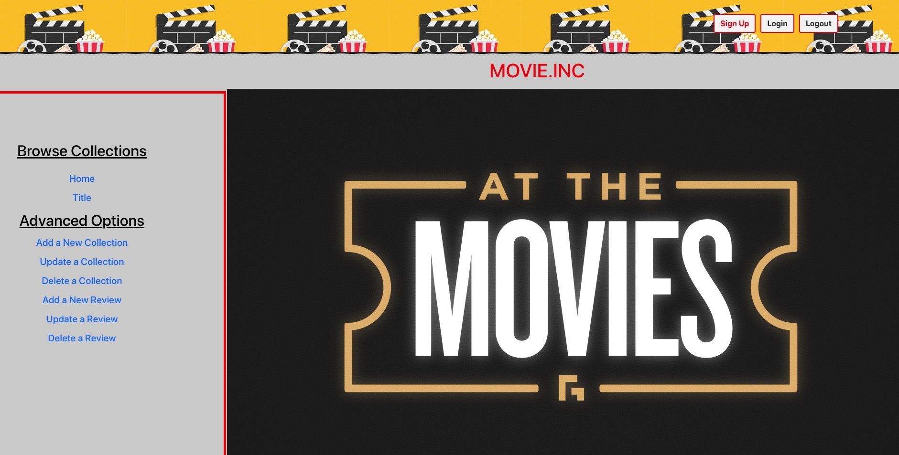

# Group MERN Project

## Description
   This frontend is part of a MERN project using a movie API that was built in the backend. The project has CRUD functionality which are the floowingf: Being able to retrieve movie titles with relevant information, add reviews, delete reviews, update a collection, delete a collection.

   Example view in the browser

   

## Features
   There are two features in this project.  
     
     Jest and enzyme to test the different components and elements of this project, In the App.test.js file you       will find components have been tested for functionality.

     Authentication: Not functional at this time.  It's a work in progress.  Will update README file once functional.

## Technologies used
   - React
   - CSS
   - Storybook
   - Jest and Enzyme

## Installation

   Please fork and clone this project.  Change to directory and run npm start to view the project in chrome.

## Unsolved Problems
   
   Authentication is not functional.  Connection to backend still with errors involving CORS and Json token not being created when requested.

## Authors

   - Jon Church
   - Thomas Pramod
   - Ruben Rivera
